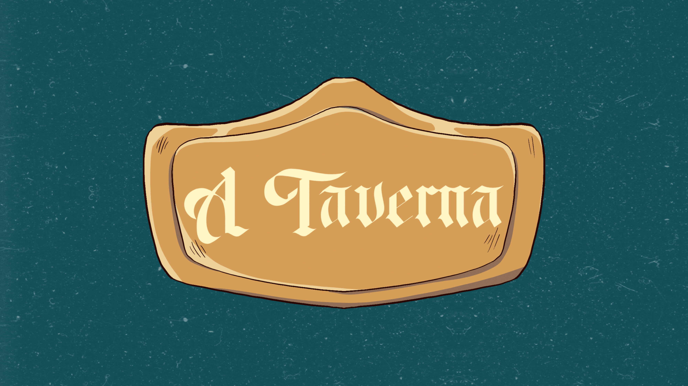

  

### Sumário: [Sobre](#sobre) • [Instalação](#instalação) • [Uso](#uso) • [Aviso](#aviso) • [Desenvolvedores](#desenvolvedores) • [Designers](#Designers) • [Requisitos Funcionais](#requisitos-funcionais) • [Estrutura](#estrutura) 

# Sobre 
A Taverna é um projeto desenvolvido por estudantes da Universidade Federal do Ceará, na disciplina de Projeto Integrado I, para A Guilda, um grupo com o compromisso de unir mestres e jogadores com interesses parecidos e intermediar as sessões para uma maior segurança. 
# Instalação

### Requisitos:
Para rodar o projeto é necessário ter em sua maquina um servidor web (o php instalado nele) e o banco de dados MySQL, tudo isso pode ser usado através do software [XAMPP] (https://www.apachefriends.org/), bastando instalá-lo e configurá-lo em sua maquina.

### Guia:
Você pode clonar este repositório ou baixar o .zip. Caso baixado o .zip, extraia na pasta htdocs do xampp. Cuidado! Ao extrair, automaticamente será criado projeto-webapp-taverna/projeto-webapp-taverna-main, recorte os arquivos e cole na pasta projeto-webapp-taverna e exclua a pasta projeto-webapp-taverna-main para a aplicação rodar sem problemas.

### Banco de Dados:
Abra o PHPmyadmin por meio do XAMPP, crie um banco de dados com o nome "taverna" e importe o arquivo taverna.sql que está na pasta do projeto. 

# Uso

Abra o XAMPP e ligue o APACHE e o MySQL. Após isso, vá ao seu navegador e acesse seu localhost. 

Link de acesso rápido: http://localhost/projeto-webapp-taverna/

# Aviso
A aplicação não está responsiva e foi codificada para telas pequenas de desktop, logo redimensionar para 1190x637 ou 1319x572 para melhor experiência.

# Desenvolvedores:
- Caio Henrique Capêlo (full stack)
- José Matheus Alvino (back-end)
- Samuel de Castro Falcão (back-end)
- Hosana Maria Carvalho (front-end)

# Designers:
- Dailane de Souza Florencio 
- Isadora Souza Granato

# Requisitos Funcionais
| Requisitos | Status | Código |
|----------|----------|----------|
| Mostrar dashboard do usuário. | Implementado | [Usuario_dashboard.php](telas/usuario/Usuario_dashboard.php) |
| Editar perfil. | Implementado | [Editar_perfil.php](telas/usuario/perfil/Editar_perfil.php) |
| Pesquisar perfil. | Implementado | [pesquisar.php](telas/pesquisar.php) |
| Cadastrar mesa. | Implementado | [Cadastro_mesa.php](telas/mesa/Cadastro_mesa.php) |
| Listar as mesas. | Implementado | [Lista_de_mesas.php](telas/mesa/Lista_de_mesas.php) |
| Mostrar as mesas do usuário. | Implementado | [Minhas_mesas.php](telas/mesa/Minhas_mesas.php) |
| Mostrar dashboard da mesa. | Implementado | [Mesa_dashboard.php](telas/mesa/Mesa_dashboard.php) |
| Inscrever-se na mesa. | Implementado | [inscrever.php](telas/mesa/inscrever.php) |
| Mostrar tela de feedback. | Não implementado | 
| Mostrar tela de denúncia.  | Implementado | [Ticket_dashboard.php](telas/usuario/denuncia/Ticket_dashboard.php) |
| Curtir perfil de terceiros. | Não implementado | 
| Abrir ticket de denúncia. | Implementado | [Abrir_ticket.php](telas/usuario/denuncia/Abrir_ticket.php) |
| Escrever notícias.  | Implementado | [Escrever_noticia.php](telas/noticias/Escrever_noticia.php) | 
| Excluir perfil próprio. | Implementado | [excluir.php](telas/usuario/perfil/excluir.php) |
| Excluir perfil de terceiros. | Implementado | [excluir.php](telas/usuario/perfil/excluir.php) |
| Mostrar notícias. | Implementado | [Lista_de_noticias.php](telas/noticias/Lista_de_noticias.php) |
| Listar perfis. | Implementado | [Lista_perfis.php](telas/usuario/perfil/Lista_perfis.php) |
| Mostrar dashboard do admin.  | Implementado | [Usuário_dashboard.php](telas/usuario/Usuario_dashboard.php) |
| Mostrar tickets de denúncia. | Implementado | [Lista_denuncia.php](telas/usuario/denuncia/Lista_denuncia.php) |
| Anunciar mesa. | Implementado | [anunciar.php](telas/mesa/anunciar.php) |
| Retirar anúncio de mesa. | Implementado | [retirar_anuncio.php](telas/mesa/retirar_anuncio.php) |
| Cadastrar usuário.| Implementado | [Cadastro.php](telas/usuario/login/Cadastro.php) |
| Logar na aplicação.| Implementado | [Login.php](telas/usuario/login/Login.php) |
| Redefinição de senha.| Implementado | [Esqueceu_senha.php](telas/usuario/login/Esqueceu_senha.php), [Redefinir_senha.php](telas/usuario/login/Redefinir_senha.php) |

# Estrutura

- **assets**
    - fonts
    - images
- **css**
- **db**
- **js**
- **php**
- **PHPMailer**
- **telas**
    - **mesa**
    - **noticias**
    - **usuario**
        - **denuncia**    
        - **login**
        - **perfil**
        - Usuario_dashboard.php
    - pesquisar.php
- **index.php**
  
Aqui está uma breve descrição de cada pasta e arquivo:

assets/: Esta pasta contém as imagens do projeto. Seja foto de perfil, favicon ou background.

css/: Aqui você tem as folhas de estilo do projeto. Foi utilizado o bootstrap para facilitar a criação do projeto.

db/: Esta pasta contém a ligação com o banco de dados. Utilizamos o objeto mysqli da linguagem PHP.

js/: Aqui você tem os scripts em JavaScript. Foi utilizado o bootstrap para facilitar a criação do projeto.

php/: Esta pasta contém o arquivo info.php onde é possível visualizar as configurações do php.

PHPMailer/: Esta pasta contém os arquivos da biblioteca PHPMailer utilizada para enviar o link de redefinição de senha por e-mail.

telas/: Aqui você tem as telas do projeto divididas em categorias. Utilizamos um sistema de código que define que telas que o usuário vê começa com letra maiúscula e telas que forem apenas funcionalidades começam com a letra minúscula.

index.php/: Porta de entrada da aplicação.

## Atualizações Futuras
  - Trocar os alerts por modals.
  - Reorganizar os redirecionamentos.
  - Fazer as media queries (responsividade).
  - Fazer as validações dos inputs.
  - Deixar o sistema auditável por meio de status no usuário.
  - Tratar os dados como a data.

(<a href="#readme-top">Voltar para o topo</a>)

**Com amor, equipe CEOS <3**
